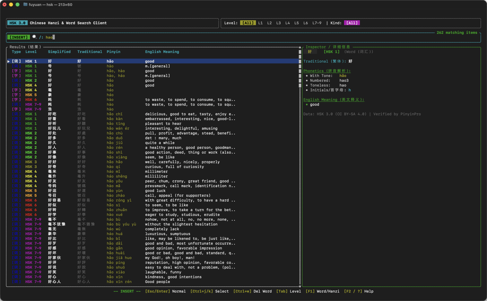

# HSK 3.0 Chinese Hanzi & Word Search Client

[](https://github.com/fuyuan9/hsk-search/actions)
[](LICENSE)
[](LICENSE-DATA)

A blazingly fast, terminal-based Chinese character and vocabulary search client for **HSK 3.0 (新版HSK考试大纲)**, built with Rust and [ratatui](https://docs.rs/ratatui/latest/ratatui/).

It combines the unrivaled **99.85% polyphone precision** of TypeScript's [pinyin-pro](https://github.com/zh-lx/pinyin-pro) with the speed, memory safety, and zero-dependency portability of a **100% pure Rust** application.

<p align="center">
  
</p>

---

## Features

- **Multi-Dimensional Search**:
  - **Toneless Pinyin**: Type `nihao` &rarr; matches `你好 (nǐ hǎo)`
  - **Pinyin Initials (拼音首字母)**: Type `yh` &rarr; matches `银行 (yínháng)`, `zg` &rarr; matches `中国 (zhōngguó)`
  - **Numbered Pinyin**: Type `yin2hang2` &rarr; matches `银行`
  - **Hanzi Direct Match**: Type `中国` or `国`
  - **English Meanings**: Type `bank` &rarr; matches `银行`, `china` &rarr; matches `中国`
- **PinyinPro High-Precision Polyphone Support**:
  - Correctly disambiguates tricky Chinese polyphones (多音字) based on linguistic context (e.g. `银行 yínháng` vs `行走 xíngzǒu`, `长大 zhǎngdà` vs `长城 chángchéng`, `音乐 yīnyuè` vs `快乐 kuàilè`).
  - Lists all legitimate pronunciations for polyphonic single characters (e.g. `行: xíng, háng, hàng, héng`).
- **Complete HSK 3.0 Dataset (14,041 entries)**:
  - **11,042 Vocabulary Words** across HSK Level 1 to Level 7-9.
  - **2,999 Hanzi (Chinese Characters)** covering the official standard syllabus.
- **Modern Terminal User Interface**:
  - Color-coded HSK level badges.
  - Full CJK display width awareness (no broken tables or cut-off Chinese characters).
  - Split-view layout: Searchable results table on the left, rich inspector card on the right.
  - Help / About modal dialog (`F2` or `?`).
- **Sub-millisecond Search Performance**:
  - Embedded zero-copy dataset, instant startup (< 5ms), < 1ms keystroke search response.

---

## Supply Chain Security & Reliability

This project adopts a strict **Defense-in-Depth** supply chain security strategy:

1. **Upstream Data Tamper Protection (SHA-256 Pinning)**:
   - All 14 raw dataset files from [`krmanik/HSK-3.0`](https://github.com/krmanik/HSK-3.0) are cryptographically verified against pinned SHA-256 hashes recorded in [`assets/checksums.sha256`](assets/checksums.sha256). Any unauthorized modification triggers an immediate abort.
2. **Strictly Minimal & Reputable Dependencies**:
   - Only **5 battle-tested, official Rust crates** are used:
     - `ratatui` (TUI framework standard)
     - `crossterm` (Pure Rust terminal abstraction)
     - `serde` & `serde_json` (De-facto serialization standard)
     - `unicode-width` (Official Unicode CJK width handling)
   - Search matching and ranking algorithms are implemented in **100% safe Rust (`src/search.rs`)** without untrusted third-party fuzzy matching crates.
3. **Reproducible Builds & Lockfile Pinning**:
   - `Cargo.lock` and `scripts/package-lock.json` are committed with exact cryptographic checksums.
   - Build script (`build.rs`) is eliminated to guarantee zero network access during compilation.
4. **Automated Security Auditing**:
   - `cargo audit` (RustSec Advisory Database) checks for CVEs.
   - `cargo deny` ensures strict license compliance and bans unauthorized crates.

---

## Quality Assurance: rustfmt, Clippy & CI

### Code Formatting
```bash
cargo fmt --all -- --check
```

### Static Analysis with Clippy
Zero-warning policy with strict pedantic lints enabled:
```bash
cargo clippy --all-targets --all-features -- -D warnings
```

### Unit & Integration Tests
```bash
cargo test --all-targets --all-features
```

### CI Workflow
All commits and pull requests are verified via GitHub Actions (`.github/workflows/ci.yml`), running fmt, clippy, tests, cargo audit, and data integrity checks.

---


## Installation

### Via Homebrew (macOS / Linux) - Recommended

```bash
brew install fuyuan9/tap/hsk
```

Or tap first and install:
```bash
brew tap fuyuan9/tap
brew install hsk
```

### Via GitHub Releases (Pre-compiled Binaries)

Download the binary archive matching your platform from the [GitHub Releases](https://github.com/fuyuan9/hsk-search/releases) page:
- **macOS (Apple Silicon M1/M2/M3/M4)**: `hsk-v*-aarch64-apple-darwin.tar.gz`
- **Linux (x86_64)**: `hsk-v*-x86_64-unknown-linux-gnu.tar.gz`
- **Linux (ARM64)**: `hsk-v*-aarch64-unknown-linux-gnu.tar.gz`
- **Windows (x64)**: `hsk-v*-x86_64-pc-windows-msvc.zip`

Extract and move `hsk` to a directory in your `$PATH` (such as `/usr/local/bin`).

### Via Cargo (From Source)

```bash
git clone https://github.com/fuyuan9/hsk-search.git
cd hsk-search
cargo install --path .
```

---

## Keybindings & Navigation

`hsk` provides a Vim-style modal navigation system to prevent collisions between pinyin input (`h, j, k, l`) and list traversal. You can also click directly on any UI section with your mouse.

### Normal Mode (Browsing & Inspection)
Press `Esc` or `Enter` from Insert mode, or click on the results table or inspector card.

| Key | Action |
| :--- | :--- |
| `j` / `↓` | Next item |
| `k` / `↑` | Previous item |
| `h` / `←` / `Shift+Tab` | Previous HSK level |
| `l` / `→` / `Tab` | Next HSK level |
| `gg` | Jump to first item |
| `G` | Jump to last item |
| `Ctrl+D` / `PgDn` | Scroll half-page down |
| `Ctrl+U` / `PgUp` | Scroll half-page up |
| `i` / `a` / `/` | Switch to **Insert mode** |
| `c` / `C` | Clear search query and switch to **Insert mode** |
| `K` / `F1` | Cycle Entry Kind (`All` → `Words` → `Hanzi`) |
| `?` / `F2` | Toggle Help & About modal window |
| `q` / `Ctrl+C` | Quit application |

### Insert Mode (Instant Search)
Starts in this mode automatically.

| Key | Action |
| :--- | :--- |
| `[Any character]` | Type pinyin (`nihao`), initials (`yh`), hanzi (`中国`), or english (`bank`) |
| `Esc` / `Enter` | Return to **Normal mode** |
| `Ctrl+J` / `Ctrl+N` | Select next item without leaving Insert mode |
| `Ctrl+K` / `Ctrl+P` | Select previous item without leaving Insert mode |
| `Ctrl+W` | Delete word backward |
| `Ctrl+U` | Clear search line |
| `Tab` / `Shift+Tab` | Cycle HSK level filter |

### Mouse Support
- **Click Search Bar**: Automatically enters **Insert mode** and focuses cursor.
- **Click Results Table**: Automatically enters **Normal mode** and selects the clicked row.
- **Click Inspector Card**: Enters **Normal mode**.
- **Mouse Wheel**: Scrolls list items up / down.

---
## Building and Running

### Prerequisites
- Rust 1.74+ (`cargo`)

### Run directly:
```bash
cargo run --release
```

### (Optional) Regenerate dataset with PinyinPro:
```bash
cd scripts
npm install
node build_dataset.mjs
```

---

## Licenses & Attributions

This project employs a dual-licensing structure to respect all upstream licenses:

- **Source Code**: [MIT License](LICENSE) (Copyright (c) 2026 fuyuan9)
- **HSK-3.0 Dataset & Derived Index**: [Creative Commons Attribution-ShareAlike 4.0 International (CC BY-SA 4.0)](LICENSE-DATA)
  - Syllabus data courtesy of the Ministry of Education of the PRC.
  - Curated word lists by Mani ([krmanik/HSK-3.0](https://github.com/krmanik/HSK-3.0)).
  - Definitions from [CC-CEDICT](https://cc-cedict.org/) and [Pleco Software](https://plecoforums.com/).
  - Phonetic assistance powered by [pinyin-pro](https://github.com/zh-lx/pinyin-pro) (MIT License).
